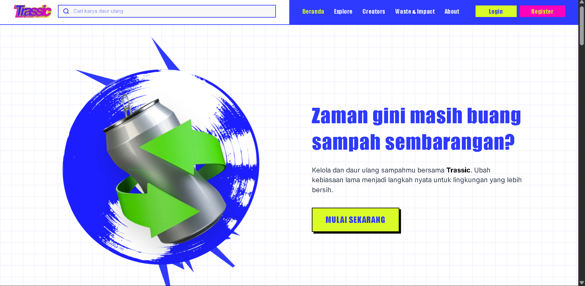
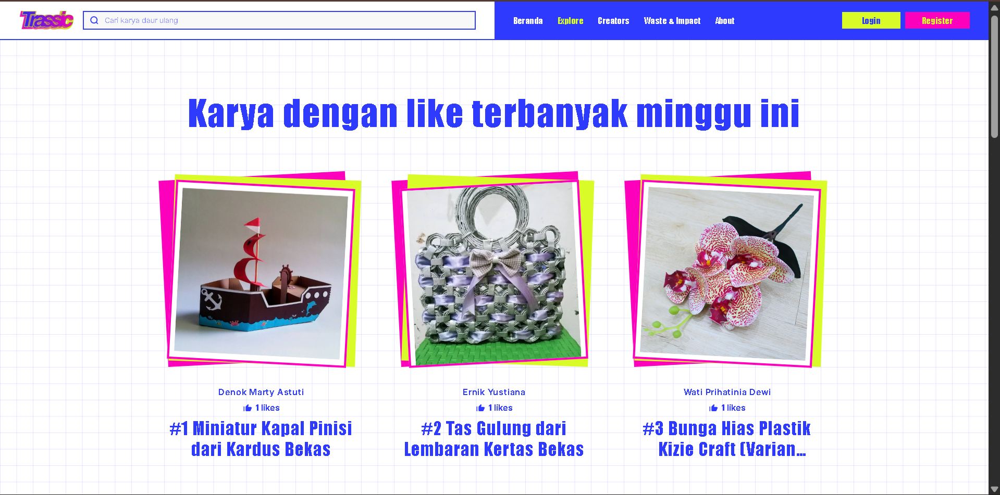
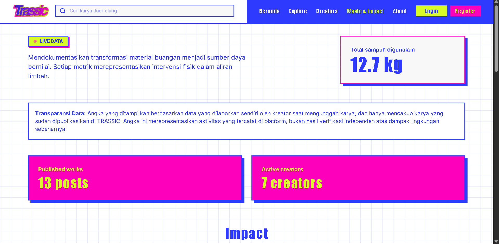

<div align="center">
  
  # TRASSIC
  ### Waste. Reworked. — Galeri Digital untuk Karya Daur Ulang Indonesia
  
  [](https://trassic.radityameyka.my.id/)
  [](https://github.com/King-Rackka/Trassic)
  [](LICENSE)
  
  **Submission for ITECHNO CUP 2026 - Web Development**
  
  **By FENDI RAJA ELANG**
  
</div>

---

## 📋 Daftar Isi

- [Tentang Proyek](#-tentang-proyek)
- [Fitur Unggulan](#-fitur-unggulan)
- [Demo & Screenshot](#-demo--screenshot)
- [Teknologi](#-teknologi)
- [Arsitektur Sistem](#-arsitektur-sistem)
- [Instalasi & Setup](#-instalasi--setup)
- [Penggunaan](#-penggunaan)
- [Testing](#-testing)
- [Tim Developer](#-tim-pengembang)
- [Lisensi](#-lisensi)

---

## 👥 Tim Developer

| Nama | Peran | GitHub |
|------|-------|--------|
| **Muhammad Daffa Syarif Syaddad** | UI/UX Designer & Team Leader | [GitHub](https://github.com/[username1]) |
| **Raditya Meyka Harry Sandhiva** | Frontend Developer | [GitHub](https://github.com/King-Rackka) |
| **Muhammad Fahreza Prasetya Ramadhan** | Backend Developer | [GitHub](https://github.com/fexartifico) |

---

## 🎯 Tentang Proyek

### Latar Belakang

Indonesia menghasilkan jutaan ton sampah setiap tahun, dan sebagian besar masih tidak terkelola dengan baik. Di sisi lain, banyak pengrajin, UMKM, dan komunitas yang telah lebih dulu mengubah limbah menjadi karya bernilai jual, namun kontribusi mereka jarang terdokumentasi secara transparan dan sulit ditemukan oleh masyarakat luas.

### Solusi yang Ditawarkan

TRASSIC hadir sebagai galeri digital yang menjembatani kreator daur ulang dengan masyarakat. Setiap karya yang diunggah disertai rincian material sampah yang digunakan (jenis, sumber, berat), sehingga dampak lingkungan dari setiap karya bisa terukur dan diverifikasi secara transparan — bukan sekadar klaim tanpa data.

### Tujuan Proyek

- 🎯 **Tujuan Utama**: Mendorong ekonomi kreatif berbasis daur ulang dengan memberi wadah dokumentasi dan apresiasi bagi kreatornya
- 📊 **Target Pengguna**: Kreator individu, UMKM, dan komunitas pengolah sampah; serta masyarakat umum yang ingin menemukan atau terinspirasi produk daur ulang
- 💡 **Value Proposition**: Satu-satunya platform yang menggabungkan galeri karya dengan data transparan penggunaan sampah per karya — bukan cuma dokumentasi produk, tapi dokumentasi dampak

---

## ✨ Fitur Unggulan

### Fitur Utama

| Fitur | Deskripsi | Keunggulan |
|----------|--------------|---------------|
| **Explore & Filter** | Jelajahi karya dengan filter berdasarkan jenis sampah (Anorganik, Botol Plastik, Kain Perca, Kardus, Kertas) | Menemukan karya berdasarkan bahan baku, bukan cuma kategori produk |
| **Submit Work** | Form unggah karya multi-gambar dengan detail rinci Waste DNA (jenis, sumber, berat sampah, bahan pendukung) | Mendukung karya dengan mixed material (lebih dari satu jenis sampah per karya) |
| **Waste & Impact Dashboard** | Metrik total sampah terpakai, breakdown material terbanyak, dengan disclaimer transparansi data | Data self-reported yang jujur diakui bukan verifikasi independen — membangun trust |
| **Creator Profile** | Profil publik kreator dengan galeri karya dan statistik kontribusi | Kreator individu maupun UMKM/komunitas punya identitas yang sama kuatnya |

### Fitur Tambahan

- **Appreciation & Follow** — apresiasi karya dan mengikuti kreator favorit secara real-time tanpa reload halaman
- **Search Real-time** — pencarian karya dan kreator dengan hasil langsung tampil saat mengetik
- **Google OAuth Login** — login cepat tanpa perlu isi form registrasi manual
- **Dashboard Kreator** — statistik personal (total karya, draft, appreciation diterima) bagi tiap kreator

---

## 📸 Demo & Screenshot

### Live Demo

🔗 **[Kunjungi Website](https://[URL_DEMO])**

### Screenshot Aplikasi

<div align="center">
  
  <p><em>Homepage - Rekomendasi harian & karya dengan like terbanyak</em></p>
  
  
  <p><em>Explore - Filter karya berdasarkan jenis sampah</em></p>
  
  
  <p><em>Waste & Impact - Dokumentasi transparan total sampah terpakai</em></p>
</div>

## 🛠️ Teknologi

### Tech Stack

#### Backend & Frontend (Monolith)
```
Framework    : Laravel 13
Komponen UI  : Livewire 4 (reactive component tanpa API terpisah)
Interaksi    : Alpine.js
Styling      : Tailwind CSS
Database     : MySQL
Auth         : Laravel Breeze + Laravel Socialite (Google OAuth)
Storage      : Laravel Filesystem (public disk)
Build Tool : Vite
```

### Alasan Pemilihan Teknologi

| Teknologi | Alasan Pemilihan |
|-----------|------------------|
| **Laravel + Livewire** | Memungkinkan fitur reaktif (filter real-time, like/follow tanpa reload, form multi-langkah) tanpa perlu membangun REST API terpisah, mempercepat development untuk tim kecil dengan deadline ketat |
| **Tailwind CSS** | Fleksibel untuk membangun design system custom (warna, tipografi, komponen kartu bergaya sticker/poster) tanpa terikat pada tema bawaan framework UI |
| **MySQL** | Relasi data antar-entitas (Work ↔ WasteDNA ↔ Creator ↔ Community) bersifat relasional dan terstruktur, cocok dengan model data tabel dibanding basis data dokumen |
| **React Three Fiber** | Membangun elemen visual identitas brand (kartu member 3D interaktif) yang lebih ekspresif dibanding elemen 2D biasa, sambil tetap embeddable di dalam halaman Blade/Livewire lewat integrasi Vite |

### Dependencies Utama

```json
{
  "require": {
    "laravel/framework": "^13.0",
    "livewire/livewire": "^4.0",
    "laravel/socialite": "^5.0",
    "laravel/breeze": "^2.0"
  },
  "devDependencies": {
    "tailwindcss": "^3.1.0",
    "alpinejs": "^3.4.2",
    "vite": "^8.0.0"
  },
  "dependencies": {
    "react": "^19.2.8",
    "react-dom": "^19.2.8",
    "three": "^0.185.1",
    "@react-three/fiber": "^9.7.0",
    "@react-three/drei": "^10.7.8",
    "@react-three/rapier": "^2.2.0",
    "gsap": "^3.15.0"
  }
}
```

---

## 🏗️ Arsitektur Sistem

### Database Schema

Entitas utama: `Work` (karya) — `WasteDna` (rincian material sampah, mendukung multi-material per karya) — `CreatorProfile` (profil publik kreator)  — `Appreciation` — `Follow`. Diagram ERD lengkap tersedia di `database/migrations/`.

### Folder Structure

```
trassic/
├── app/
│   ├── Livewire/          # Komponen reaktif (Explore, Creators, Dashboard, dll)
│   ├── Models/             # Eloquent models (Work, WasteDna, CreatorProfile, dll)
│   └── Http/Controllers/   # Controller pendukung (Auth, Profile)
├── resources/
│   ├── views/
│   │   ├── livewire/       # View tiap komponen Livewire
│   │   └── layouts/        # Layout utama (navbar, footer)
│   └── css/js/             # Asset Tailwind & Alpine
├── database/
│   ├── migrations/         # Skema seluruh tabel
│   └── seeders/            # Data contoh (kreator & karya nyata terinspirasi UMKM Indonesia)
├── routes/
│   └── web.php             # Seluruh routing aplikasi
└── public/
    └── storage/            # Symlink ke storage gambar upload
```

---

## ⚙️ Instalasi & Setup

### Prerequisites

Pastikan sudah terinstall:
- **PHP** (v8.2 atau lebih tinggi)
- **Composer**
- **Node.js** (v20.x atau lebih tinggi) & **npm**
- **MySQL**
- **Git**

### Langkah Instalasi

#### 1️⃣ Clone Repository

```bash
git clone https://github.com/[username]/trassic.git
cd trassic
```

#### 2️⃣ Install Dependencies

```bash
composer install
npm install
```

#### 3️⃣ Setup Environment Variables

```bash
cp .env.example .env
php artisan key:generate
```

Untuk mendapatkan `GOOGLE_CLIENT_ID` dan `GOOGLE_CLIENT_SECRET`:
1. Buka [Google Cloud Console](https://console.cloud.google.com/apis/credentials)
2. Buat OAuth 2.0 Client ID baru (atau gunakan yang sudah ada)
3. Tambahkan `http://localhost:8000/auth/google/callback` ke Authorized redirect URIs
4. Copy Client ID dan Client Secret ke `.env`

Isi konfigurasi berikut di `.env`:

```env
DB_CONNECTION=mysql
DB_HOST=127.0.0.1
DB_PORT=3306
DB_DATABASE=trassic
DB_USERNAME=root
DB_PASSWORD=

GOOGLE_CLIENT_ID=
GOOGLE_CLIENT_SECRET=
GOOGLE_REDIRECT_URI=http://localhost:8000/auth/google/callback
```

#### 4️⃣ Setup Database

```bash
php artisan migrate:fresh --seed
```

#### 5️⃣ Buat Symlink Storage

```bash
php artisan storage:link
```

#### 6️⃣ Build Asset Frontend

```bash
npm run build
```

#### 7️⃣ Run Development Server

```bash
php artisan serve
```

Aplikasi akan berjalan di `http://localhost:8000`

---

## 🚀 Penggunaan

### Menjalankan Aplikasi

```bash
# Development mode (Vite dev server + Laravel server, jalankan di 2 terminal)
npm run dev
php artisan serve

# Production build
npm run build
```

### User Guide

#### Untuk Pengguna Umum

1. **Registrasi/Login**: Klik **Register** untuk membuat akun baru, atau login cepat via **Google**
2. **Jelajahi Karya**: Buka halaman **Explore**, gunakan filter jenis sampah untuk menemukan karya sesuai minat
3. **Submit Karya**: Klik **+ Submit Your Work**, isi judul, deskripsi, unggah foto, dan detail Waste DNA (jenis, sumber, berat sampah)
4. **Ikuti Kreator**: Kunjungi profil kreator favorit dan klik **Ikuti** untuk mengikuti karya-karya terbarunya

#### Untuk Kreator

1. **Kelola Karya**: Akses **Dashboard** untuk melihat statistik karya (total, draft, appreciation diterima)
2. **Edit Profil**: Lengkapi bio, lokasi, tipe kreator, dan tautan media sosial di halaman edit profil

---

## 🧪 Testing

Pengujian dilakukan secara manual pada seluruh alur pengguna utama: registrasi, login (email & Google), submit karya, filter Explore, follow/appreciate, dan navigasi Waste & Impact — untuk memastikan loop *Discover → Create → Publish* berjalan end-to-end tanpa error.

---

## 📄 Lisensi

Proyek ini dilisensikan di bawah [MIT License](LICENSE) - lihat file LICENSE untuk detail lebih lanjut.

---

<div align="center">

  **Made with ❤️ by [FENDI RAJA ELANG] for ITECHNO CUP 2026**

</div>